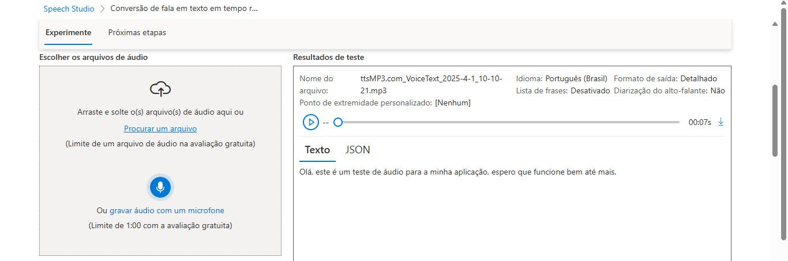
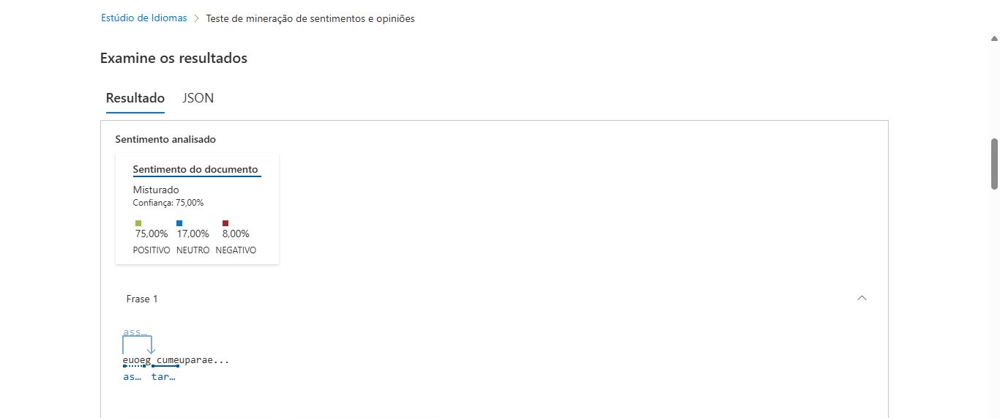

# 📌 Análise de Sentimentos e Transcrição de Áudio

> Projeto criado para demonstrar a transcrição de áudio e análise de sentimentos/opiniões usando IA.

## 📖 Sobre

Este projeto tem como objetivo aplicar técnicas de processamento de linguagem natural (NLP) para transcrição de áudio e análise de sentimentos. Durante o desenvolvimento, exploramos as capacidades de IA para transformar um áudio em texto e avaliar as emoções contidas no texto gerado.

## 🚀 Tecnologias Utilizadas

Este projeto foi desenvolvido com as seguintes tecnologias:

- [Azure Cognitive Services](https://azure.microsoft.com/pt-br/products/cognitive-services/)
- [Language Studio](https://language.cognitive.azure.com/)

## 📂 Estrutura do Projeto

```
📁 language-studio-azure
├── 📄 README.md
├── 📄 audio.mp3
├── 📁 inputs
│   └── 📄 sentences.txt  # Texto gerado a partir da transcrição
├── 📁 images
│   ├── 📄 captura-de-tela-1.png  # Print da transcrição do áudio
│   ├── 📄 captura-de-tela-2.png  # Print do teste de sentimentos
```

## 📸 Prints do Processo

Aqui estão alguns prints mostrando os resultados do projeto:

- **Transcrição de Áudio:**
  

- **Análise de Sentimentos:**
  

## 📜 Insights e Aprendizados

Durante a realização deste projeto, foram observadas as seguintes possibilidades:

- A IA é capaz de interpretar o tom emocional do texto gerado.
- Diferentes modelos de NLP podem influenciar os resultados da análise.
- O pré-processamento do áudio pode impactar diretamente na qualidade da transcrição.

